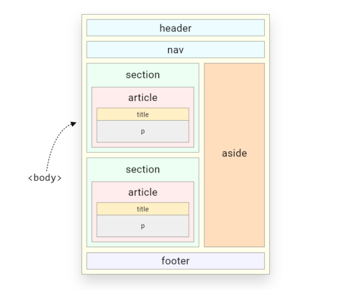

<link rel="stylesheet" href="../../templates/main.css"></link>

# 01.02-semantics

> semantic elements = elements with a meaning!

## Wat zijn semantieke elementen

Een semantisch element beschijft wat de betekenis van het element aan de browser maar ook aan de developer.

Het ```<div>``` en ```<span>``` zijn elementen die geen betekenis hebben, deze vertellen niets over de inhoud.

Elementen zoals ```<form>```, ```<table>```, ```<article>``` vertellen letterlijk wat de inhoudt zal zijn. Een tag zoals ```<article>``` heeft dezelfde eigenschappen als een ```<div>``` het heeft enkel meer context over de inhoudt.

## Semantische tags

- ```<article>```
- ```<aside>```
- ```<details>```
- ```<figcaption>```
- ```<figure>```
- ```<footer>```
- ```<header>```
- ```<main>```
- ```<mark>```
- ```<nav>```
- ```<section>```
- ```<summary>```
- ```<time>```



Met de volgende website is het mogelijk om de tree van uw website te bekijken: [tree viewer by yoksel](https://yoksel.github.io/html-tree/en/).

<div class=page-break></div>


## ```<section>``` tag
```
<section>
    <h1>WWF</h1>
    <p>The World Wide Fund for Nature (WWF) is an international organization working on issues regarding the conservation, research and restoration of the environment, formerly named the World Wildlife Fund. WWF was founded in 1961.</p>
</section>

<section>
    <h1>WWF's Panda symbol</h1>
    <p>The Panda has become the symbol of WWF. The well-known panda logo of WWF originated from a panda named Chi Chi that was transferred from the Beijing Zoo to the London Zoo in the same year of the establishment of WWF.</p>
</section>
```

```<section>``` is een generiek sectie-element en mag alleen worden gebruikt als er geen specifieker element is om het weer te geven. Een navigatiemenu moet bijvoorbeeld worden verpakt in een ```<nav>```-element, maar een lijst met zoekresultaten of een kaartweergave en de bedieningselementen hebben geen specifieke elementen en kunnen in een ```<section>``` worden geplaatst.


## ```<article>``` tag
```
<article>
    <h2>Google Chrome</h2>
    <p>Google Chrome is a web browser developed by Google, released in 2008. Chrome is the world's most popular web browser today!</p>
</article>

<article>
    <h2>Mozilla Firefox</h2>
    <p>Mozilla Firefox is an open-source web browser developed by Mozilla. Firefox has been the second most popular web browser since January, 2018.</p>
</article>

<article>
    <h2>Microsoft Edge</h2>
    <p>Microsoft Edge is a web browser developed by Microsoft, released in 2015. Microsoft Edge replaced Internet Explorer.</p>
</article>
```

Een bepaald document kan meerdere artikelen bevatten, op een blog die de tekst van elk artikel één voor één toont terwijl de gebruiker scrolt, zou elk bericht bijvoorbeeld in een ```<article>```-element staan, mogelijk met een of meer ```<section>```-tags binnen in het ```<article>``` element. Zoals in het voorbeeld hieronder.

```
<article class="film_review">
  <h2>Jurassic Park</h2>
  <section class="main_review">
    <h3>Review</h3>
    <p>Dinos were great!</p>
  </section>
  <section class="user_reviews">
    <h3>User reviews</h3>
    <article class="user_review">
      <h4>Too scary!</h4>
      <p>Way too scary for me.</p>
      <footer>
        <p>
          Posted on
          <time datetime="2015-05-16 19:00">May 16</time>
          by Lisa.
        </p>
      </footer>
    </article>
    <article class="user_review">
      <h4>Love the dinos!</h4>
      <p>I agree, dinos are my favorite.</p>
      <footer>
        <p>
          Posted on
          <time datetime="2015-05-17 19:00">May 17</time>
          by Tom.
        </p>
      </footer>
    </article>
  </section>
  <footer>
    <p>
      Posted on
      <time datetime="2015-05-15 19:00">May 15</time>
      by Staff.
    </p>
  </footer>
</article>
```

<div class="page-break"></div>

## ```<aside>``` tag

```
<article>
  <p>
    The Disney movie <cite>The Little Mermaid</cite> was
    first released to theatres in 1989.
  </p>

  <aside>
    <p>
      The movie earned $87 million during its initial release.
    </p>
  </aside>
  
  <p>
    More info about the movie…
  </p>
</article>
```

In dit voorbeeld wordt ```<aside>``` gebruikt om een alinea in een artikel te markeren. De paragraaf is slechts indirect gerelateerd aan de inhoud van het hoofdartikel.