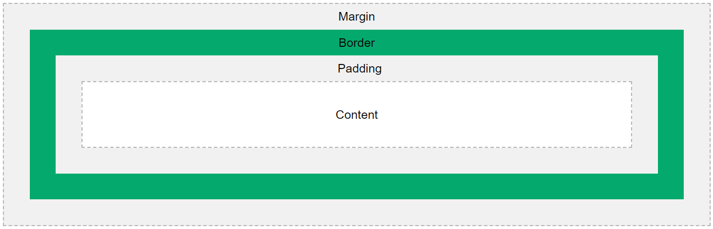

<link rel="stylesheet" href="../../templates/main.css"></link>

# 02.04-box-model

In CSS wordt de term "box-model" gebruikt als het over ontwerp en lay-out gaat.

Het CSS-boxmodel is in wezen een box die zich om elk HTML-element wikkelt. Het bestaat uit: `margin`, `border`, `padding` en de eigenlijke `content`. De afbeelding hieronder illustreert het boxmodel:



- **Margin**: Voegt een gebied toe buiten de border. De marge is transparant.
- **Border**: Een rand die rond de padding en content gaat.
- **Padding**: Voegt een gebied toe rond de content. De vulling is transparant.
- **Content**: De inhoud van het element, waar tekst en afbeeldingen verschijnen.

> **Note:** Om te totale breedte of hoogte van een element te berekenen zijn we dus verplicht om de `height` of  `width` van de content te nemen + `padding` + `margin` + `border`.

<div style='page-break-after: always;'></div>

*Voorbeeld:*
```
div {
  width: 320px;
  padding: 10px;
  border: 5px solid gray;
  margin: 0;
}
```


In bovenstaand voorbeeld zou de totale breedte 350px moeten bedragen.

```
div initiele breedte is: 320px
+ padding links:         10px
+ padding rechts:        10px
+ border links:          5px
+ border rechts:         5px
+ margin links:          0px
+ margin rechts:         0px

---------------------------------------
                         350 px
```