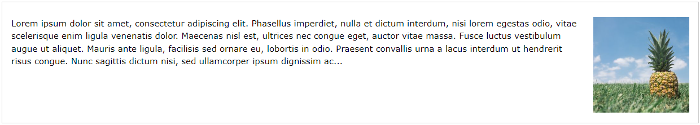
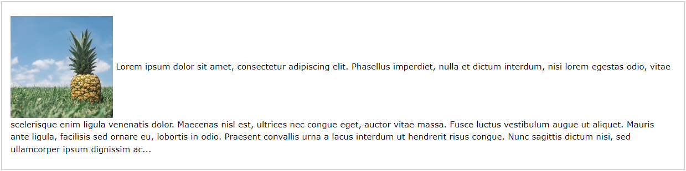
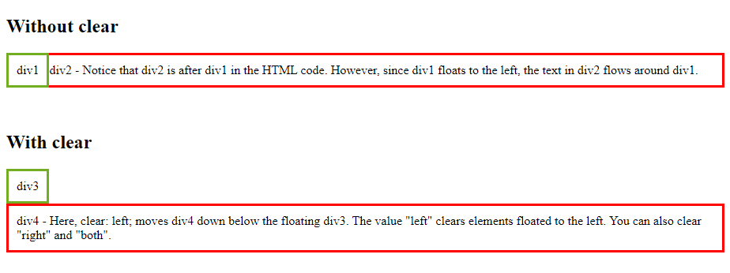

<link rel="stylesheet" href="../../templates/main.css"></link>

# 02.10-float-and-clear
## Float
Met de CSS `float` property kunnen we bepalen hoe een element moet zweven.
Er zijn verschillende waardes die de `float` property accepteert.

De `clear` property zal aanduiden welke elementen kunnen zweven naast een `cleared` element en aan welke kant.

- `left`: Met de waarde `left` zal het element links zweven in de container.
- `right`: Met de waarde `right` zal het element rechts zweven in de container.
- `none`: Bij deze waarde zal het element niet zweven het zal worden getoond waar het
- `inherit`: Een element met deze waarde erft de `float` waarde van zijn parent element.

*Voorbeeld:*
```
img {
    float: right;
}
```

*Resultaat:*


<div style='page-break-after: always;'></div>

*Voorbeeld:*
```
img {
    float: none;
}
```

*Resultaat:*



## Clear
Wanneer we gebruik maken van float maar we willen het volgende element niet naast het zwevende element hebben maar eronder gebruiken we de clear property.

Met de clear property kunnen we verschillende waardes meegeven.
- `none`: Het element zal niet naar onder, links of rechts geduwd worden.
- `left`: Het element wordt onder links zwevende elementen geduwd.
- `right`: Het element wordt onder rechts zwevende elementen geduwd.
- `both`: Het element wordt onder links en rechts zwevende elementen geduwd.
- `inherit`: Het element zal de waarde overnemen van zijn parent/bovenliggend element.

<div style='page-break-after: always;'></div>

*Voorbeeld:*
```
.div1 {
  float: left;
  padding: 10px;
  border: 3px solid #73AD21;
}

.div2 {
  padding: 10px;
  border: 3px solid red;
}

.div3 {
  float: left;
  padding: 10px;  
  border: 3px solid #73AD21;
}

.div4 {
  padding: 10px;
  border: 3px solid red;
  clear: left;
}
```
*Resultaat:*
